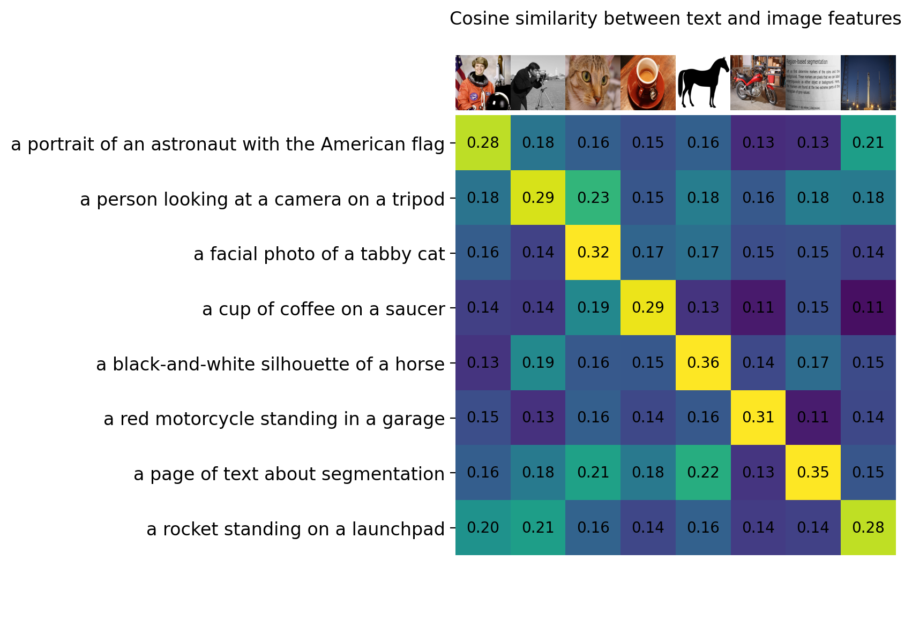
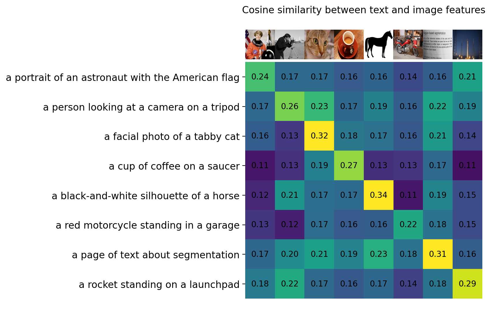

# CLIP + TOME
This repository contains code for practicing the integration of **TOME** (Token Merging) into **CLIP** (Contrastive Language-Image Pre-training). 

The main objective is to replace neural network modules related to `timm` and `swag` from the `tome.patch` with `attn_tome` that employs corresponding modules from the CLIP source code.

## Related work
CLIP: [https://github.com/OpenAI/CLIP](https://github.com/OpenAI/CLIP)

TOME: [https://github.com/facebookresearch/tome](https://github.com/facebookresearch/tome)

## CLIP with efficient vision tower
### Before TOME:

### After TOME with 1.78x throughput:

## Summary
In my experiments, TOME does indeed help accelerate the vision tower in Clip, but applying TOME to the text tower results in completely disastrous outcomes.

 A reasonable explanation is that *text lacks the redundancy present in images, thus merging tokens leads to the loss of important information*.